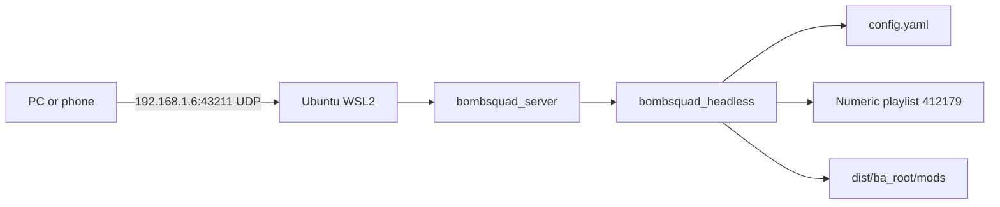

# VH Server Quick Guide

## Current Setup



Current server address:

```text
192.168.1.6:43211
```

Start it from PowerShell:

```powershell
$repo = '/mnt/c/Users/upadh/OneDrive/Desktop/Projects/VH-Bombsquad-Modded-Server-Files'
wsl -d Ubuntu -- bash -lc "cd '$repo' && exec python3.10 bombsquad_server --noninteractive --no-auto-restart"
```

Stop it with `Ctrl+C` in the running terminal.

## Current Playlist

The server now uses a numeric shared playlist:

```yaml
playlist_code: 412179
playlist_shuffle: true
teams_series_length: 40
ffa_series_length: 40
```

In this repository, `412179` is labelled `ffasmash` in `setting.json`. Numeric shared playlists are downloaded from the BombSquad service. Their maps, game types, powerups, and per-game settings are controlled by the playlist owner, not by the local `playlist_inline` entries.

Important distinction:

| Mode | Configuration | Can locally control game rules? |
|---|---|---|
| Numeric shared playlist | `playlist_code: 412179` | Limited; the shared playlist decides the games |
| Custom duel | `playlist_inline` with `ClassicDuel.DuelClassicGame` | Yes; edit the entries and `ClassicDuel.py` |

To return to the custom duel, remove `playlist_code` and use an inline entry:

```yaml
playlist_inline:
- type: ClassicDuel.DuelClassicGame
  settings:
    map: Doom Shroom
    Kills to Win Per Player: 40
    Time Limit: 0
    Enable Powerups: false
    Epic Mode: false
    Allow Negative Scores: false
playlist_shuffle: false
```

Do not keep both `playlist_code` and `playlist_inline`; `playlist_code` takes precedence.

## Score Targets

For the current numeric playlist:

```yaml
teams_series_length: 40
ffa_series_length: 40
```

These are stock shared-session series settings. They do not change the custom duel activity.

For custom duels, change this inside every inline playlist entry:

```yaml
Kills to Win Per Player: 40
```

The custom duel computes its target as:

```text
kills to win per player x largest team size
```

For a normal 1v1, `Kills to Win Per Player: 40` means 40 kills to end the duel.

## Creating A Custom Playlist

Each item is one round:

```yaml
playlist_inline:
- type: ClassicDuel.DuelClassicGame
  settings:
    map: Doom Shroom
    Kills to Win Per Player: 40
    Time Limit: 0
    Enable Powerups: false
    Epic Mode: false
    Allow Negative Scores: false
- type: ClassicDuel.DuelClassicGame
  settings:
    map: Crag Castle
    Kills to Win Per Player: 40
    Time Limit: 0
    Enable Powerups: false
    Epic Mode: false
    Allow Negative Scores: false
playlist_shuffle: true
```

Use `playlist_shuffle: false` to play in listed order. Use `true` to randomize.

Current known melee maps used by this server:

```text
Doom Shroom
Rampage
Hockey Stadium
Crag Castle
Big G
Football Stadium
```

The game must support the map. The authoritative runtime list is `ba.getmaps('melee')`.

## Duel Settings

| Setting | Meaning |
|---|---|
| `Kills to Win Per Player` | Kill target for a custom duel |
| `Time Limit: 0` | No time limit |
| `Enable Powerups: false` | No standard powerup drops |
| `Epic Mode: false` | Normal speed and music |
| `Allow Negative Scores: false` | Suicides cannot reduce score below zero |
| `max_party_size: 3` | Server plus two active players |

The custom duel is implemented in:

```text
dist/ba_root/mods/games/ClassicDuel.py
```

It provides the two-active-player queue, waiting icons, boxing gloves, respawn, farthest spawn selection, and kill scoring.

## Powerups

For custom duels, the simplest competitive setting is:

```yaml
Enable Powerups: false
```

For the custom powerup mod, edit `dist/ba_root/mods/setting.json`:

```json
"elPatronPowerups": {
  "enable": false
}
```

If it stays enabled, set unwanted entries to `0` in both `settings.Powerups` and `Quantity`:

```json
"Shield": 0,
"Punch": 0,
"Health": 0,
"Curse": 0,
"Speed": 1,
"Ice Bombs": 1
```

Keep those two tables consistent.

## Effects And Competitive Presentation

Disable visual effects and cosmetic overlays in `setting.json`:

```json
"enabletags": false,
"enablehptag": false,
"enablerank": false,
"enableeffects": false,
"ShiningPlayers": false,
"enableTop5effects": false,
"EnablePlayerProfilesTag": false,
"enableTagAnimation": false,
"enableOldHitTexts": false,
"enableNewHitTexts": false,
"colorfullMap": false,
"colorful_explosions": false,
"textonmap": { "enable": false }
```

Keep this local WSL setting disabled:

```json
"textonmap": { "enable": false }
```

The overlay expects `_ba.our_ip`, which is unavailable in this local WSL runtime.

## Pure Competitive Preset

For custom duels, use:

```yaml
max_party_size: 3
playlist_shuffle: true

settings:
  Kills to Win Per Player: 40
  Time Limit: 0
  Enable Powerups: false
  Epic Mode: false
  Allow Negative Scores: false
```

Also disable cosmetics and custom powerups as shown above.

## Owners And Admins

Add a PB ID to both places for full control:

```yaml
# config.yaml
admins:
- pb-EXAMPLE
```

```json
// dist/ba_root/mods/playersData/roles.json
"owner": {
  "commands": ["ALL"],
  "ids": ["pb-EXAMPLE"]
}
```

Back up `roles.json` before editing it.

## Validate Before Restarting

```powershell
wsl -d Ubuntu -- python3.10 -c "import yaml; yaml.safe_load(open('/mnt/c/Users/upadh/OneDrive/Desktop/Projects/VH-Bombsquad-Modded-Server-Files/config.yaml')); print('config valid')"
wsl -d Ubuntu -- python3.10 -c "import json; json.load(open('/mnt/c/Users/upadh/OneDrive/Desktop/Projects/VH-Bombsquad-Modded-Server-Files/dist/ba_root/mods/setting.json')); print('settings valid')"
wsl -d Ubuntu -- ss -lunp | Select-String '43211'
```

Backups:

```powershell
Copy-Item .\config.yaml .\config.yaml.backup
Copy-Item .\dist\ba_root\mods\setting.json .\dist\ba_root\mods\setting.json.backup
Copy-Item .\dist\ba_root\mods\playersData\roles.json .\dist\ba_root\mods\playersData\roles.json.backup
```
